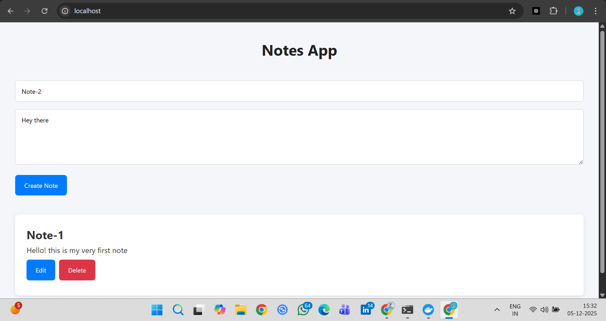
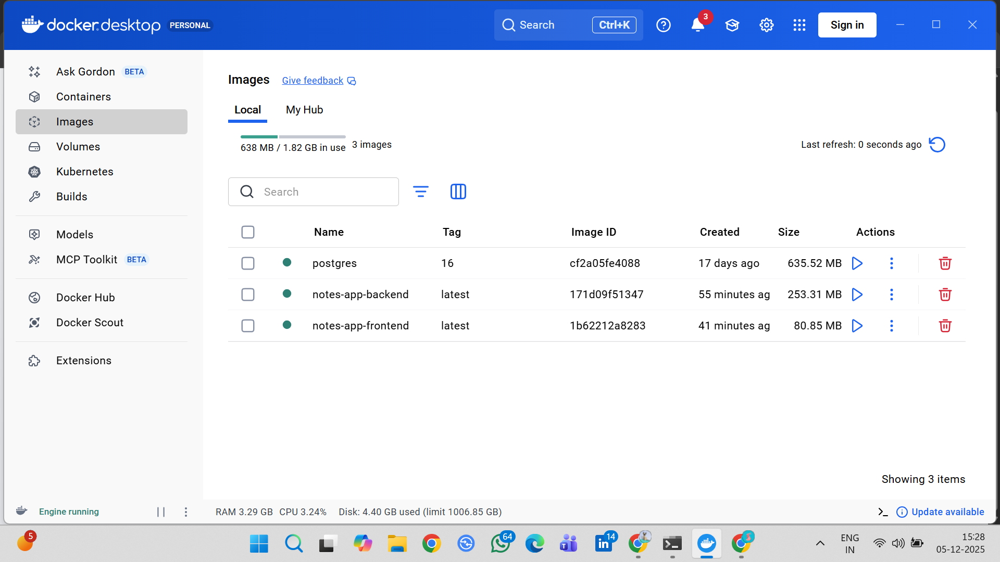
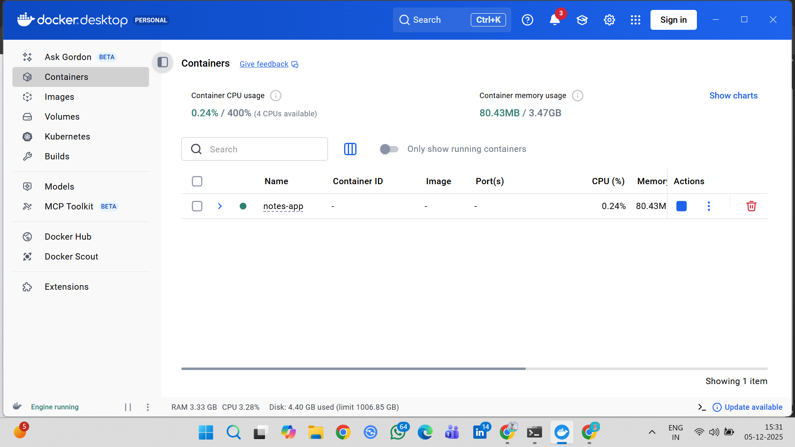
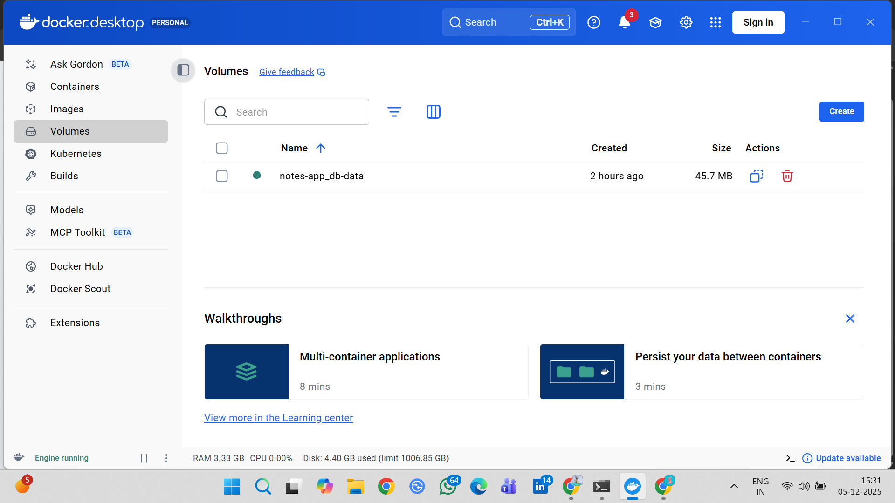

# Notes App – 3-Tier Full-Stack Application  
**FastAPI • React • PostgreSQL • Nginx • Docker Compose**

A robust, scalable **3-tier web application** for managing personal notes including creating, editing, and deleting notes. Containerized with multi-stage Dockerfiles and orchestrated via Docker Compose, the app deploys effortlessly on AWS EC2— embodying modern DevOps best practices for maintainability, security, and scalability.

## Features

- **Frontend** – Modern React SPA (Create React App) with instant feedback
- **Backend** – FastAPI (Python) with full CRUD API and automatic OpenAPI docs
- **Database** – PostgreSQL with persistent storage
- **Reverse Proxy** – Nginx serves React build and proxies `/api/*` → FastAPI
- **Docker Compose** – One-command local development and production deployment
- **Zero CORS issues** – All API calls go through Nginx proxy
- **Clean URLs** – Access the app at `/` and API at `/api`

## Tech Stack

| Layer           | Technology                          |
|-----------------|-------------------------------------|
| Frontend        | React 18 + Axios                    |
| Backend         | FastAPI + SQLAlchemy + Uvicorn      |
| Database        | PostgreSQL 16                       |
| Web Server      | Nginx (Alpine)                      |
| Containerization| Docker + Docker Compose             |
| Language        | Python 3.12, Node 20                |

## Project Structure

```text
notes-app/
├── backend/                  # FastAPI backend
│   ├── app/
│   │   ├── main.py
│   │   ├── crud.py
│   │   ├── database.py
│   │   ├── models.py
│   │   └── schemas.py
│   ├── requirements.txt
│   ├── .dockerignore
│   └── Dockerfile
├── frontend/                 # React frontend
│   ├── public/
│   │   ├── index.html
│   ├── src/
│   │   ├── App.js
│   │   ├── index.js
│   │   └── index.css
│   ├── nginx/
│   │   └── nginx.conf        # Nginx reverse proxy config
│   ├── .dockerignore
│   ├── Dockerfile
│   └── package.json
├── docker-compose.yml
├── .dockerignore
├── .env                      
├── .gitignore                # gitignored – DB credentials
└── README.md
```

## Quick Start (Local)

```bash
# Clone the repo
git clone https://github.com/rashmirawat1/Notes-app.git
cd Notes-app

# Copy and adjust environment variables (optional)
cp .env.example .env # Edit .env if you want custom DB user/password

# Start everything
docker compose up --build -d

# Open the app
Main App → http://localhost
FastAPI Swagger UI → http://localhost/api/docs
FastAPI ReDoc → http://localhost/api/redoc
Direct backend test → http://localhost:8000/docs
```

## Docker Commands

```bash
# View logs
docker compose logs -f

# Stop everything
docker compose down

# Full cleanup (including database)
docker compose down -v

# Rebuild after code changes
docker compose up --build -d
```

## Deployment (AWS EC2, DigitalOcean, etc.)

- SSH into your server
- Install Docker + Docker Compose
- Clone this repository
- Run:
```bash
    docker compose up -d
```
- Open port 80 and your app will be live at your server’s public IP or domain!
- Create environment Variables (.env file) 
```bash
    envDB_USER=user
    DB_PASSWORD=password
    DB_NAME=notesdb
    #You can change these – just keep them in sync in docker-compose.yml
```

## Screenshots

### Notes App


### Docker Configuration 







## Contribution
Pull requests are welcome! Feel free to:
- Improve UI/UX
- Search & filter
- Export notes as Markdown/PDF
- Add authentication
- Add Unit & Integration tests
- Optimize Dockerfiles

Enjoy your blazing-fast, fully containerized notes app!